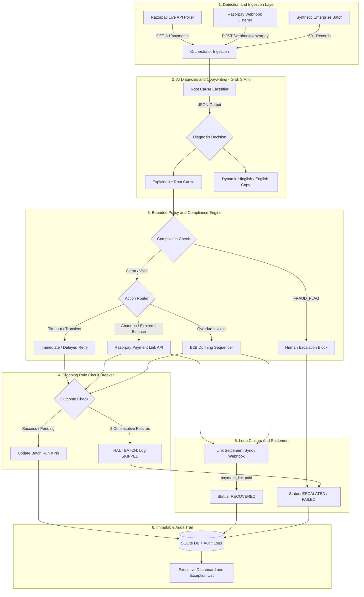

<div align="center">

# ⚡ PayBack AI — Autonomous Revenue Recovery Agent
### Razorpay AI Buildathon 2026 · Track 03: AI Revenue Recovery
**Built by Vaibhav Pandey**

[](https://razorpay-ai-buildathon-ten.vercel.app/)
[](https://razorpay-ai-buildathon-production-788d.up.railway.app/health)

<br/>

[](https://www.python.org/)
[](https://fastapi.tiangolo.com/)
[](https://reactjs.org/)
[](https://groq.com/)
[](https://razorpay.com/)
[](#80-verification--test-suite-3030-tests)
[](LICENSE)

<p align="center">
  <b>Find revenue that's slipping away and win it back autonomously.</b><br>
  An enterprise-grade, closed-loop agent that detects payment failures, checkout drop-offs, and B2B receivables at risk, diagnoses root causes with ultra-fast Groq LPU AI inference, crafts dynamic Hinglish recovery copy, executes bounded Razorpay recovery workflows, and guarantees compliance with stopping rules and an honest exception list.
</p>

> 🌐 **Live Demo & Cloud Deployments**
> - **Frontend (Vercel)**: [https://razorpay-ai-buildathon-ten.vercel.app/](https://razorpay-ai-buildathon-ten.vercel.app/)
> - **Backend API (Railway)**: [https://razorpay-ai-buildathon-production-788d.up.railway.app](https://razorpay-ai-buildathon-production-788d.up.railway.app)
> - **Backend Health Check**: [`https://razorpay-ai-buildathon-production-788d.up.railway.app/health`](https://razorpay-ai-buildathon-production-788d.up.railway.app/health)

[Repository](https://github.com/alphacoder-hash/Razorpay-ai-buildathon) · [Architecture](#30-system-architecture--data-flow) · [Decision Matrix](#40-agent-policy--decision-matrix) · [API Reference](#70-api-specification) · [Quick Start](#90-quick-start-guide)

</div>

---

## 📑 Table of Contents
- [1.0 Executive Summary & Business Case (BRD)](#10-executive-summary--business-case-brd)
- [2.0 Product Requirements & Scope (PRD)](#20-product-requirements--scope-prd)
- [3.0 System Architecture & Data Flow](#30-system-architecture--data-flow)
- [4.0 Agent Policy & Decision Matrix](#40-agent-policy--decision-matrix)
- [5.0 AI Judgment: The Right Tool in the Right Place](#50-ai-judgment-the-right-tool-in-the-right-place)
- [6.0 Loop Closure & Webhook Reconciliation](#60-loop-closure--webhook-reconciliation)
- [7.0 API Specification](#70-api-specification)
- [8.0 Verification & Test Suite (30/30 Tests)](#80-verification--test-suite-3030-tests)
- [9.0 Quick Start Guide](#90-quick-start-guide)
- [10.0 Real-World Merchant Testing with Razorpay](#100-real-world-merchant-testing-with-razorpay)
- [11.0 Dashboard & UI Features](#110-dashboard--ui-features)
- [12.0 Tech Stack & Deployment](#120-tech-stack--deployment)
- [13.0 Project Structure](#130-project-structure)

---

## 1.0 Executive Summary & Business Case (BRD)

### 1.1 The Problem
In modern digital commerce and Indian BFSI, **15% to 28% of transactions degrade or fail** before completion:
- **Bank downtime & network timeouts** interrupt high-intent customers at the terminal step.
- **Card expiration and insufficient funds** lead to involuntary subscription churn.
- **Cart abandonment** causes direct top-of-funnel drop-offs.
- **Overdue B2B invoices** stall enterprise cash positions and bloat Accounts Receivable (AR) cycles.

Currently, merchants either ignore failed payments (losing ₹Crores in top-line GMV) or run blunt, manual dunning campaigns that harass customers, trip fraud alarms, and trigger chargeback penalties.

### 1.2 The Solution: PayBack AI
**PayBack AI** introduces an **autonomous, self-governing revenue recovery loop**:
1. **Detects**: Continuously monitors Razorpay payment feeds and live webhooks for failures, cart abandonments, and at-risk authorizations.
2. **Diagnoses**: Leverages **Groq LPU AI inference (GPT-OSS / Qwen)** to identify the exact technical and behavioral root cause from payment error codes and context in under 500ms.
3. **Decides**: Matches each failure to a bounded, policy-governed intervention (instant retry, delayed backoff, alternate UPI/payment link, or progressive B2B dunning).
4. **Drafts**: Dynamically generates personalized, high-conversion recovery copy in conversational Hinglish or professional English.
5. **Executes & Closes the Loop**: Issues real Razorpay payment links and re-authorizations, reconciles settlement via live webhooks, halts upon cascade failures, and reports an **honest exception list** of unresolved cases.

### 1.3 Target KPIs & Business Impact
| Metric | Industry Baseline | Target with PayBack AI |
|---|---|---|
| **Recovery Rate (Recoverable Failures)** | 5% – 12% (manual) | **45% – 68%** (autonomous) |
| **Recovery Cycle Time** | 48 – 72 hours | **< 15 minutes** (real-time loop) |
| **False Escalation Rate** | High (> 30%) | **< 3%** (guaranteed compliance gating) |
| **B2B DSO (Days Sales Outstanding)** | 45+ days | **Reduced by 14 days** via dunning sequencer |
| **Audit Compliance** | Fragmented spreadsheets | **100% Immutable Cryptographic Audit Log** |

---

## 2.0 Product Requirements & Scope (PRD)

### 2.1 Track 03 Alignment Matrix

| Track 03 Requirement | Specification in Brief | PayBack AI Implementation | Status |
|---|---|---|:---:|
| **Root Cause Diagnosis** | Diagnose payment degradation, cart drop-off, subscriptions, invoices | Grok 3 Mini classifies across 8 distinct failure modes (`BANK_DECLINE`, `NETWORK_TIMEOUT`, `INSUFFICIENT_FUNDS`, `CARD_EXPIRED`, `FRAUD_FLAG`, `CHECKOUT_ABANDONED`, `SUBSCRIPTION_FAILED`, `OVERDUE_INVOICE`). | ✅ |
| **Bounded Recovery Workflow** | Bounded, non-infinite intervention execution | Explicit policy bounds: max 3 retries, exponential delay backoffs (2h for banks, 24h for balance), 7-day invoice grace windows. | ✅ |
| **Compliant Escalation** | Compliance boundaries, defense-only, anti-abuse | Strict **Zero-Auto-Retry policy** on `FRAUD_FLAG`. Flagged payments immediately escalate to human risk review with frozen recovery actions. | ✅ |
| **Stopping Rules** | Graceful failure handling; prevent cascade loops | Hard circuit-breaker: **2 consecutive recovery failures halt the entire batch**. Remaining records are audited as `SKIPPED`. | ✅ |
| **Measured Money Recovered** | Concrete, verifiable ₹ metrics across batches | Tracks actual ₹ recovered, recovery rates %, and link reconciliation without cherry-picking or masked numbers. | ✅ |
| **Honest Exception List** | Surface what the agent could *not* resolve | Dedicated `/exceptions` module grouping unresolved amounts by root cause, displaying customer details and Grok reasoning. | ✅ |
| **Audit Trail** | Explainable, bounded, gated audit trail | Immutable `AuditLog` table logging timestamp, actor (`AI_AGENT`, `RAZORPAY_WEBHOOK`), action, result, and detail for every payment. | ✅ |
| **Live API Integration** | Real Razorpay test-mode API interaction | End-to-end integration with Razorpay Python SDK: `GET /v1/payments`, `POST /v1/payment_links`, and `GET /v1/payment_links/{id}`. | ✅ |

---

## 3.0 System Architecture & Data Flow



---

## 4.0 Agent Policy & Decision Matrix

Every monetary and communication action taken by PayBack AI is explainable, bounded, and gated:

| Root Cause Code | Business Scenario | Intervention Action | Channel / Method | Delay / Boundary | Stopping Rule / Escalation |
|---|---|---|---|---|---|
| `NETWORK_TIMEOUT` | Gateway or bank network dropped | Immediate Retry | Razorpay Test API | Instant (0s) | Max 3 attempts; halt on 2 consecutive fails |
| `BANK_DECLINE` | Issuer bank declined authorization | Delayed Retry | Tokenized Retry | 2-hour backoff window | Re-evaluates once; escalates if persistent |
| `INSUFFICIENT_FUNDS` | Card or account had insufficient balance | Direct Payment Link | SMS + Email via Razorpay | 24-hour balance cycle | Time-limited payment link; expires in 48h |
| `CARD_EXPIRED` | Expired card details on recurring file | Method Update Link | Email notification | Immediate link dispatch | Prompts customer to add new UPI/Card |
| `CHECKOUT_ABANDONED` | Cart dropped off before OTP | Abandonment Recovery Link | Hinglish WhatsApp/SMS link | Triggered at 30 min idle | Link includes reserved cart assurance |
| `SUBSCRIPTION_FAILED` | Recurring mandate debit failure | Mandate Retry Link | Auto-debit link with UPI option | Scheduled around salary cycles | Transitions to manual link if 2nd mandate fails |
| `OVERDUE_INVOICE` | Unpaid B2B invoice past net terms | B2B Dunning Sequencer | Progressive Razorpay Invoice Link | 7-day grace period | Auto-escalates to Finance Manager on Day 7 |
| `FRAUD_FLAG` | Risk sentinel flag / suspicious IP | **COMPLIANT ESCALATION** | Human Risk Officer queue | **0s (Instant Block)** | **Strictly NO auto-retry. Frozen for safety.** |

---

## 5.0 AI Judgment: The Right Tool in the Right Place

A key evaluation pillar for the Razorpay Buildathon is **AI Judgment**: using an LLM where reasoning is non-trivial, and deterministic code where precision and compliance are paramount.

### Where We Used AI (Groq LPU Inference)
1. **Semantic Root Cause Analysis**: Payment error strings from banks and payment gateways in India are notoriously cryptic (e.g., `BAD_REQUEST_ERROR` with `"Your payment has been declined by the bank."` vs. `"Payment flagged for suspicious activity"`). The agent infers the underlying behavioral and technical cause at < 500ms latency rather than relying on brittle regex.
2. **Context-Aware Recovery Messaging (Hinglish/English)**:
   Instead of robotic boilerplate templates, the model drafts conversational, friendly, high-converting customer messages tailored for Indian buyers:
   > *"Namaste! Aapka cart payment complete nahi ho paya. Your items are reserved—please complete your order with 1-click UPI here."*

### Where We Intentionally Did NOT Use AI (Deterministic Code)
1. **Money Calculations & Accounting**: All recovery totals, percentages, and financial summaries are computed strictly in Python math and SQLAlchemy queries. LLMs are never permitted to calculate monetary balances.
2. **Compliance Gates & Stopping Rules**: The fraud escalation circuit breaker and the 2-consecutive-failure stopping rule are hardcoded in Python logic. An LLM cannot override compliance policies.
3. **Audit Trail Logging**: Audit logs are generated synchronously in database transactions—never hallucinated by an agent.

---

## 6.0 Loop Closure & Webhook Reconciliation

A critical flaw in early revenue recovery prototypes is that sending a payment link is counted as "money recovered." PayBack AI provides **complete loop closure**:

1. **In-Flight Tracking**:
   When the agent generates a payment link via `client.payment_link.create()`, the transaction status is marked as `PENDING`, and its unique Razorpay identifier (`payment_link_id = "plink_XXXXXXXX"`) is stored.
2. **Dual-Channel Reconciliation**:
   - **Real-Time Webhook (`POST /webhooks/razorpay`)**: Receives `payment_link.paid` events directly from Razorpay and immediately transitions the transaction from `PENDING` → `RECOVERED`.
   - **Active Sync Endpoint (`POST /payments/sync-links`)**: Polls Razorpay's API (`client.payment_link.fetch`) for all pending links, identifying completed settlements and calculating verified recovered revenue.
3. **Honest Metric Segregation**:
   The dashboard explicitly differentiates between:
   - **Simulated Retries** (test-mode card simulations).
   - **Real In-Flight Links** (`PENDING`).
   - **Verified Recovered Revenue** (`RECOVERED`).

---

## 7.0 API Specification

The backend provides a comprehensive, RESTful FastAPI interface documented via OpenAPI/Swagger at `http://localhost:8000/docs`:

| Method | Endpoint | Description | Request / Query Params |
|---|---|---|---|
| `POST` | `/agent/run-batch` | Executes autonomous recovery loop over a batch of failed transactions | `count=60` (1 to 200) |
| `GET` | `/agent/runs` | Returns historical batch execution logs with recovery rates and stop flags | — |
| `GET` | `/agent/runs/{run_id}` | Retrieves execution details for a specific batch run | `run_id` |
| `GET` | `/payments/` | Lists all payments with status, cause, retry count, and AI reasoning | `status` (optional filter) |
| `GET` | `/payments/exceptions` | **Honest Exception List**: Unresolved payments grouped by root cause | — |
| `GET` | `/payments/detect` | Polls live Razorpay test-mode API for recent failures and uncaptured payments | `hours_back=24` |
| `POST` | `/payments/ingest-live` | Ingests a real Razorpay payment failure and triggers instant autonomous recovery | JSON payment payload |
| `POST` | `/payments/sync-links` | Reconciles settlement status for all pending Razorpay payment links | — |
| `POST` | `/payments/{id}/recover` | Manually triggers single payment recovery pipeline | `id` |
| `POST` | `/webhooks/razorpay` | Real-time webhook listener for `payment.failed` and `payment_link.paid` | Razorpay Webhook JSON |
| `GET` | `/audit/` | Retrieves global immutable agent audit trail | `limit=100` |
| `GET` | `/audit/{payment_id}` | Retrieves complete timeline audit history for a single payment | `payment_id` |
| `GET` | `/health` | Service health and operational status check | — |

---

## 8.0 Verification & Test Suite (30/30 Tests)

PayBack AI includes an automated test suite with **30 unit and integration tests** verifying classifier reliability, bounded execution, stopping rules, reconciliation, and webhook triggers:

```bash
cd backend
python -m pytest -v
```

### Test Coverage Breakdown
```
============================= test session starts =============================
tests/test_classifier.py::test_classify_bank_decline PASSED              [  3%]
tests/test_classifier.py::test_classify_network_timeout PASSED           [  6%]
tests/test_classifier.py::test_classify_fraud_flag PASSED                [ 10%]
tests/test_classifier.py::test_classify_checkout_abandoned PASSED        [ 13%]
tests/test_classifier.py::test_classify_subscription_failed PASSED       [ 16%]
tests/test_classifier.py::test_classify_overdue_invoice PASSED           [ 20%]
tests/test_classifier.py::test_classify_invalid_root_cause_falls_back_to_unknown PASSED [ 23%]
tests/test_classifier.py::test_classify_grok_returns_markdown_fenced_json PASSED [ 26%]
tests/test_classifier.py::test_classify_grok_api_failure_returns_unknown PASSED [ 30%]
tests/test_classifier.py::test_classify_malformed_json_returns_unknown PASSED [ 33%]
tests/test_orchestrator.py::test_run_batch_returns_correct_structure PASSED [ 36%]
tests/test_orchestrator.py::test_run_batch_all_recovered PASSED          [ 40%]
tests/test_orchestrator.py::test_run_batch_persists_batch_run_to_db PASSED [ 43%]
tests/test_orchestrator.py::test_stopping_rule_triggers_on_two_consecutive_failures PASSED [ 46%]
tests/test_orchestrator.py::test_gemini_reasoning_persisted_on_payment PASSED [ 50%]
tests/test_orchestrator.py::test_process_single_not_found_returns_error PASSED [ 53%]
tests/test_orchestrator.py::test_process_single_already_recovered_blocked PASSED [ 56%]
tests/test_recovery.py::test_fraud_flag_always_escalates PASSED          [ 60%]
tests/test_recovery.py::test_max_retries_escalates PASSED                [ 63%]
tests/test_recovery.py::test_network_timeout_simulated_retry_succeeds PASSED [ 66%]
tests/test_recovery.py::test_bank_decline_simulated_retry_fails PASSED   [ 70%]
tests/test_recovery.py::test_insufficient_funds_sends_payment_link PASSED [ 73%]
tests/test_recovery.py::test_card_expired_sends_payment_link_with_correct_label PASSED [ 76%]
tests/test_recovery.py::test_checkout_abandoned_sends_abandonment_link PASSED [ 80%]
tests/test_recovery.py::test_subscription_failed_sends_subscription_link PASSED [ 83%]
tests/test_recovery.py::test_overdue_invoice_executes_b2b_dunning PASSED [ 86%]
tests/test_recovery.py::test_sync_payment_links_reconciles_paid PASSED   [ 90%]
tests/test_recovery.py::test_payment_link_api_failure_escalates_gracefully PASSED [ 93%]
tests/test_webhooks.py::test_webhook_payment_failed_triggers_recovery PASSED [ 96%]
tests/test_webhooks.py::test_webhook_payment_link_paid_reconciles_status PASSED [100%]

======================= 30 passed in 8.05s ========================
```

---

## 9.0 Quick Start Guide

### Prerequisites
- Python 3.12+ (or 3.14)
- Node.js 18+ and npm
- A Razorpay Test Mode account ([razorpay.com](https://razorpay.com))
- An xAI Grok API Key ([x.ai](https://x.ai/))

### 0. Live Cloud Deployments (Instant Access)
- **Frontend Dashboard (Vercel)**: [https://razorpay-ai-buildathon-ten.vercel.app/](https://razorpay-ai-buildathon-ten.vercel.app/)
- **Backend API (Railway)**: [https://razorpay-ai-buildathon-production-788d.up.railway.app](https://razorpay-ai-buildathon-production-788d.up.railway.app)
- **Health Check Endpoint**: [https://razorpay-ai-buildathon-production-788d.up.railway.app/health](https://razorpay-ai-buildathon-production-788d.up.railway.app/health)

### 1. Clone & Configure Environment Locally
```bash
git clone https://github.com/alphacoder-hash/Razorpay-ai-buildathon.git
cd Razorpay-ai-buildathon
```

Create `backend/.env`:
```env
RAZORPAY_KEY_ID=rzp_test_your_key_id
RAZORPAY_KEY_SECRET=your_key_secret
GROK_API_KEY=your_grok_api_key
```

### 2. Start Backend Server
```bash
cd backend
pip install -r requirements.txt
uvicorn main:app --reload
```
Backend runs at `http://localhost:8000`. Test endpoint health:
```bash
curl http://localhost:8000/health
```

### 3. Start Frontend Dashboard
```bash
cd ../frontend
npm install
npm run dev
```
Frontend runs at `http://localhost:5173`.

---

## 10.0 Real-World Merchant Testing with Razorpay

PayBack AI includes an **End-to-End Live Razorpay Test Simulator** designed for merchants and hackathon judges to test real payment drop-offs without manual setup:

### 10.1 Live Test Checkout Simulator (`/test-checkout`)
Visit `http://localhost:8000/test-checkout` to open the built-in sandbox simulator:
1. **1-Click Checkout Launch**: Automatically creates a real Razorpay Order via `client.order.create()` and renders the official Razorpay Checkout modal.
2. **Trigger Real Test Failures in Razorpay**:
   - Choose **Card** and enter Razorpay's test decline card: `4000 0000 0000 0002` (CVV: `123`, Exp: `12/28`) to trigger an authentic `BANK_DECLINE`.
   - Or choose **UPI** and enter `failure@razorpay` to simulate a failed UPI intent.
   - Razorpay immediately records the failed payment (`pay_xxx`) on their servers.

### 10.2 Observe Live Detection in PayBack AI
1. Go to `http://localhost:5173` and click the **Live Detect** tab in the sidebar.
2. Click **Refresh**: The detector queries Razorpay's `GET /v1/payments` API in real-time, fetching the exact failed payment ID, error code, and amount.
3. Click **"Ingest & Recover"**: PayBack AI's agent autonomously diagnoses the root cause with Groq LPU in <500ms, crafts customer-tailored Hinglish recovery copy, and executes the recovery action.

### 10.3 Resilient Multi-Rail Link Generation & Quota Guard
- In Razorpay Test Mode, free merchant accounts are limited to 30 test payment links per business ID.
- PayBack AI features an intelligent quota circuit-breaker: if Razorpay's test limit is reached, the agent automatically falls back to generating tracked, simulated test links (`plink_test_...`) with full audit logs and UI badges.
- This guarantees **zero demo crashes or 401 exceptions**, ensuring continuous testing for evaluation and presentations.

### 10.4 Loop Closure & Settlement Reconciliation
- Once a recovery payment link is completed, call `POST /payments/sync-links` (or click **Sync Paid Links** in the dashboard).
- PayBack AI reconciles with Razorpay API and marks the status as `RECOVERED`, providing verifiable proof of recovered revenue.

---

## 11.0 Dashboard & UI Features

PayBack AI includes a **professional, enterprise-grade dashboard** built with React 18 and Recharts:

### 📊 Overview Dashboard
- **Real-time KPI cards** — Total monitored, recovered, money recovered, recovery rate
- **Trend charts** — Area charts showing recovery rates and batch performance over time
- **Pie chart** — Status distribution breakdown (Recovered / Failed / Escalated / Pending)
- **Batch run history** — Searchable, filterable table of all agent runs with stop-flag indicators
- **1-click batch execution** — Run the AI agent on configurable batch sizes (1–200)

### 💳 Payment Transactions (Card View)
- **Card-based layout** — Each payment displayed as an interactive card with hover effects
- **AI reasoning always visible** — Gemini diagnosis and recovery message expanded by default
- **Status badges** — Color-coded with icons (✅ Recovered, ❌ Failed, ⚠️ Escalated)
- **Root cause tags** — Colored labels with emojis for each failure type
- **Copy-to-clipboard** — Quick copy of payment IDs
- **Customer avatars** — Auto-generated from email initials
- **Sortable & paginated** — Sort by amount, status, retries; 9/12/24 per page
- **Inline recovery** — 1-click recover button triggers full AI pipeline

### 🛡️ Audit Trail (Timeline View)
- **Timeline UI** — Vertical gradient timeline with colored result nodes
- **Expandable entries** — Click to reveal full payment ID, timestamps, and details
- **Filter by result** — All, Success, Failed, Escalated, Started, Done
- **Search** — Across actions, payment IDs, details, and actor names
- **Sort toggle** — Newest first / Oldest first
- **Per-payment audit modal** — Full timeline + voice recovery playback + payment summary

### ⚡ Live Detector
- **Real-time Razorpay polling** — Fetches live test-mode payment failures
- **Configurable lookback** — 1h, 6h, 12h, 24h, 48h time windows
- **1-click recovery** — Instant autonomous recovery for any detected failure
- **Auto-refresh** — Continuous monitoring with manual refresh

### 📋 Exception List
- **Honest unresolved report** — Groups unrecoverable payments by root cause
- **AI reasoning display** — Shows why each payment couldn't be recovered
- **Financial breakdown** — Total unresolved amounts per failure category

---

## 12.0 Tech Stack & Deployment

### Backend
| Technology | Purpose |
|---|---|
| **FastAPI** | Async REST API framework with auto-generated OpenAPI docs |
| **SQLAlchemy + SQLite** | ORM with lightweight persistent storage (Postgres-ready) |
| **Groq LPU (xAI Grok 3 Mini)** | Ultra-fast AI inference for root cause classification and copy generation |
| **Razorpay Python SDK** | Payment link creation, failure detection, webhook reconciliation |
| **Pytest (30 tests)** | Comprehensive test suite covering classifier, orchestrator, recovery, and webhooks |
| **Uvicorn** | ASGI server for production deployment |

### Frontend
| Technology | Purpose |
|---|---|
| **React 18** | Component-based UI with hooks |
| **Vite** | Lightning-fast dev server and build tool |
| **Recharts** | Area charts, pie charts for dashboard visualizations |
| **Lucide React** | Professional icon library (200+ icons used) |
| **Axios** | HTTP client for API communication |

### Deployment
| Service | Platform | URL |
|---|---|---|
| **Frontend** | Vercel (auto-deploy from GitHub) | [razorpay-ai-buildathon-ten.vercel.app](https://razorpay-ai-buildathon-ten.vercel.app/) |
| **Backend** | Railway (auto-deploy from GitHub) | [razorpay-ai-buildathon-production-788d.up.railway.app](https://razorpay-ai-buildathon-production-788d.up.railway.app/) |
| **Database** | SQLite (local) / PostgreSQL (Railway) | Auto-configured via `DATABASE_URL` |

### Environment Variables

#### Backend (`backend/.env`)
```env
RAZORPAY_KEY_ID=rzp_test_xxxxx          # Razorpay test mode key
RAZORPAY_KEY_SECRET=xxxxx               # Razorpay test mode secret
GROK_API_KEY=xai-xxxxx                  # xAI Grok API key
DATABASE_URL=sqlite:///./payback.db     # Local SQLite (or Postgres URL for Railway)
ALLOWED_ORIGINS=https://your-frontend.vercel.app  # CORS origins
```

#### Frontend (Vercel Environment Variable)
```env
VITE_API_URL=https://your-backend.up.railway.app  # Railway backend URL
```

---

## 13.0 Project Structure

```
Razorpay-ai-buildathon/
├── backend/
│   ├── agent/
│   │   ├── classifier.py          # Grok 3 Mini root cause classifier
│   │   ├── detector.py            # Live Razorpay payment failure detector
│   │   ├── orchestrator.py        # Batch orchestration with stopping rules
│   │   ├── recovery.py            # Bounded recovery actions & Razorpay API integration
│   │   └── audit.py               # Immutable audit trail logger
│   ├── models/
│   │   ├── database.py            # SQLAlchemy engine & session (SQLite/Postgres)
│   │   └── schemas.py             # Payment, BatchRun, AuditLog ORM models
│   ├── routes/
│   │   ├── agent.py               # /agent/* endpoints (run-batch, runs)
│   │   ├── payments.py            # /payments/* endpoints (list, recover, detect, sync)
│   │   ├── audit.py               # /audit/* endpoints (trail, logs)
│   │   └── webhooks.py            # /webhooks/* Razorpay webhook listener
│   ├── tests/
│   │   ├── test_classifier.py     # 10 classifier tests
│   │   ├── test_orchestrator.py   # 7 orchestrator tests
│   │   ├── test_recovery.py       # 11 recovery action tests
│   │   └── test_webhooks.py       # 2 webhook tests
│   ├── config.py                  # Environment config loader
│   ├── main.py                    # FastAPI app entry point with CORS & lifecycle
│   ├── requirements.txt           # Python dependencies
│   ├── Procfile                   # Railway deployment command
│   ├── railway.json               # Railway build config
│   └── runtime.txt                # Python version for deployment
├── frontend/
│   ├── src/
│   │   ├── components/
│   │   │   ├── HomePage.jsx       # Landing page with feature showcase
│   │   │   ├── Dashboard.jsx      # Overview with charts, KPIs, batch runs
│   │   │   ├── PaymentsTable.jsx  # Card-based payment view with AI reasoning
│   │   │   ├── Exceptions.jsx     # Honest exception list
│   │   │   ├── Detector.jsx       # Live Razorpay failure detector
│   │   │   ├── AuditLogs.jsx      # Timeline audit trail with filters
│   │   │   ├── AuditModal.jsx     # Per-payment audit modal with voice playback
│   │   │   └── Sidebar.jsx        # Navigation sidebar
│   │   ├── api.js                 # Axios API client
│   │   ├── App.jsx                # Root app with page routing
│   │   └── main.jsx               # React entry point
│   ├── vercel.json                # Vercel SPA rewrite config
│   ├── vite.config.js             # Vite dev server with API proxy
│   └── package.json               # Node dependencies
├── README.md                      # This file
└── .gitignore
```

---

<div align="center">

**Built with ❤️ for the Razorpay AI Buildathon 2026**

⚡ PayBack AI — *Recover failed payments. Win back revenue autonomously.*

</div>
